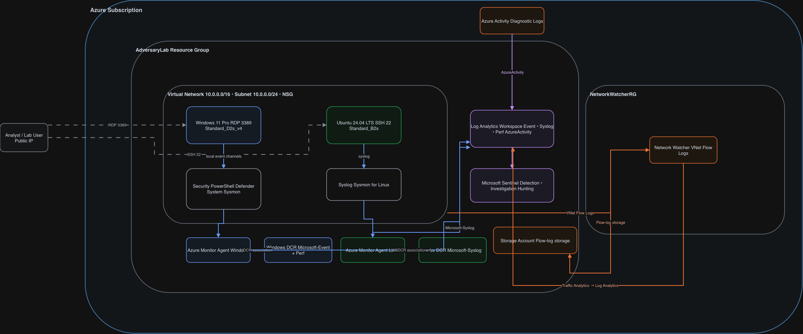

# Adversary Lab - Azure Detection Engineering Environment

AdversaryLab is a dual-endpoint Azure security lab for practicing detection engineering, threat hunting, adversary emulation, and security monitoring with Microsoft Sentinel and Log Analytics.

The lab deploys both a Windows 11 endpoint and an Ubuntu 24.04 LTS endpoint, connects each to Azure Monitor Agent (AMA), and sends Windows event telemetry and Linux syslog into a shared Log Analytics workspace.

## Overview

AdversaryLab includes:

- **Windows 11 Pro VM** with Azure Monitor Agent
- **Ubuntu 24.04 LTS VM** with Azure Monitor Agent
- **Microsoft Sentinel** enabled on the shared Log Analytics workspace
- **Separate Windows and Linux Data Collection Rules (DCRs)**
- **Windows event collection** for Security, PowerShell, Defender, System, and Sysmon channels
- **Linux Syslog collection** for operating system and Sysmon for Linux events
- **Azure Activity Logs**
- **VNet Flow Logs** with Traffic Analytics
- **Network Security Group controls** restricting RDP and SSH to your public IP
- **Blue Team tooling** for Windows Sysmon, PowerShell logging, and audit policy
- **Sysmon for Linux bootstrap**
- **Optional Red Team tooling** for Azure and Entra ID security testing

## Architecture



The lab uses a shared virtual network and Log Analytics workspace with separate Windows and Linux collection paths. Data Collection Rules configure each Azure Monitor Agent; endpoint telemetry is then delivered to Log Analytics, where Microsoft Sentinel provides detection, investigation, and hunting. Azure Activity and VNet Flow Logs add subscription and network telemetry.

Both endpoints share the same virtual network and NSG. RDP (3389) and SSH (22) are restricted to the public IP supplied during deployment.

## Repository Structure

```text
adversary-lab/
├── README.md
├── CONTRIBUTING.md
├── CHANGELOG.md
├── adversary_lab_deploy.ps1
├── main.bicep
├── main_subscription.bicep
│
├── img/
│   └── AdversaryLab-Architecture.svg
│
├── modules/
│   ├── networking.bicep
│   ├── storage.bicep
│   ├── log_analytics.bicep
│   ├── vm.bicep
│   ├── linux_vm.bicep
│   ├── vm_monitoring.bicep
│   ├── linux_vm_monitoring.bicep
│   ├── sentinel.bicep
│   ├── network_monitoring.bicep
│   └── network_monitoring_flowlog.bicep
│
├── scripts/
│   ├── AdversaryLab-BlueTeam.ps1
│   ├── AdversaryLab-RedTeam.ps1
│   └── Install-SysmonLinux.sh
│
└── cheatsheets/
    └── Azure_Log_Reference.md
```

## What Gets Deployed

### Windows endpoint

Default size: `Standard_D2s_v4`

The Windows DCR collects:

- Security event log
- Microsoft-Windows-PowerShell/Operational
- Microsoft-Windows-Windows Defender/Operational
- System critical/error events
- Microsoft-Windows-Sysmon/Operational
- Selected performance counters

Windows events are sent to the Log Analytics `Event` table.

### Linux endpoint

Default size: `Standard_B2s`

Image:

- Canonical Ubuntu 24.04 LTS
- Offer: `ubuntu-24_04-lts`
- SKU: `server`

The Linux DCR currently collects all Syslog facilities and severities. This broad configuration is intentional for lab validation and should be tuned if ingestion volume becomes excessive.

Linux events are sent to the Log Analytics `Syslog` table.

### Shared services

- Log Analytics workspace
- Microsoft Sentinel
- Azure Activity diagnostic logs
- VNet Flow Logs
- Storage account for flow logs
- Network Watcher integration
- Monthly budget alert when an email address is supplied
- Daily VM auto-shutdown

## Prerequisites

### Required software

| Software | Installation |
|---|---|
| PowerShell 7 | `winget install --id Microsoft.PowerShell --source winget` |
| Azure PowerShell (Az) | `Install-Module -Name Az -Repository PSGallery -Force` |
| VS Code | `winget install -e --id Microsoft.VisualStudioCode` |
| Git | `winget install Git.Git` |
| Bicep CLI | `winget install -e --id Microsoft.Bicep` |

### Azure requirements

- Azure subscription
- Contributor-equivalent permissions for the resources being deployed
- Permission to create subscription-scope diagnostic settings and flow-log resources
- Valid notification email if budget/shutdown notifications are enabled

### Network requirements

- Public IP address for management access
- Outbound internet access from both endpoints
- RDP 3389 restricted to your public IP
- SSH 22 restricted to your public IP

## Quick Start

### 1. Clone the repository

```powershell
git clone https://github.com/purpleshellsecurity/AdversaryLab.git
cd AdversaryLab
```

### 2. Deploy the lab

Run from PowerShell 7:

```powershell
./adversary_lab_deploy.ps1
```

The deployment script prompts for:

- Resource group
- Azure region
- Subscription ID
- Administrator username/password
- Public IP allowed through the NSG
- Optional notification email
- Auto-shutdown settings

The deployment creates both endpoints and prints:

- Windows VM name and public IP
- Linux VM name and public IP
- RDP command
- SSH command
- Log Analytics workspace
- Sentinel link

Credentials are also written to `credentials.txt` in the deployment directory.

> [!WARNING]
> `credentials.txt` contains the VM password in plaintext. Record the credentials you need and delete the file.

## Connect to the Endpoints

### Windows

```text
mstsc /v:<WINDOWS_PUBLIC_IP>
```

### Linux

```bash
ssh <ADMIN_USERNAME>@<LINUX_PUBLIC_IP>
```

## Windows Blue Team Setup

`AdversaryLab-BlueTeam.ps1` manages:

- Sysmon
- PowerShell script block logging
- PowerShell module logging
- PowerShell transcription
- Windows audit policy
- Command-line capture for process creation events

### Interactive install

Run on the Windows VM as Administrator:

```powershell
.\scripts\AdversaryLab-BlueTeam.ps1 -Action Install
```

Install only Sysmon:

```powershell
.\scripts\AdversaryLab-BlueTeam.ps1 -Action Install -Component Sysmon
```

### Unattended install

Use `-Yes` to skip the confirmation prompt without forcing a reinstall:

```powershell
.\scripts\AdversaryLab-BlueTeam.ps1 -Action Install -Yes
```

Use `-Force` when you intentionally want to skip the prompt and reinstall selected components even if they are already present:

```powershell
.\scripts\AdversaryLab-BlueTeam.ps1 -Action Install -Component Sysmon -Force
```

This distinction matters when using `Invoke-AzVMRunCommand`: a run-command execution cannot answer an interactive `Read-Host` prompt.

### Verify locally

```powershell
.\scripts\AdversaryLab-BlueTeam.ps1 -Action Test
```

For Sysmon specifically:

```powershell
Get-Service Sysmon*

Get-WinEvent -FilterHashtable @{
    LogName   = 'Microsoft-Windows-Sysmon/Operational'
    StartTime = (Get-Date).AddMinutes(-30)
} |
Select-Object -First 10 TimeCreated, Id, ProviderName
```

### Windows Sysmon reboot note

On Windows 11, Sysmon installation can occasionally require one reboot before the service and event channel are fully available. If the Blue Team script reports that Sysmon did not start and requires a reboot, complete any Windows first-run setup that is blocking normal sign-in, reboot the VM, and rerun:

```powershell
.\scripts\AdversaryLab-BlueTeam.ps1 -Action Install -Component Sysmon
```

Do not treat this condition as an Azure Monitor or DCR failure. Verify Sysmon locally first.

## Linux Sysmon Setup

The Linux installer supports Ubuntu 24.04 and 22.04. Ubuntu 24.04 is the validated lab image.

Copy or execute `scripts/Install-SysmonLinux.sh` on the Linux VM as root.

Example through Azure Run Command:

```powershell
Invoke-AzVMRunCommand `
    -ResourceGroupName '<RESOURCE_GROUP>' `
    -VMName '<LINUX_VM_NAME>' `
    -CommandId 'RunShellScript' `
    -ScriptPath './scripts/Install-SysmonLinux.sh'
```

The script installs:

- Microsoft package repository
- `sysinternalsebpf`
- `sysmonforlinux`

It then enables the `sysmon` systemd service and prints recent local Sysmon events.

### Verify locally

```bash
systemctl status sysmon --no-pager
journalctl -u sysmon --no-pager -n 20
grep -i sysmon /var/log/syslog | tail -n 20
```

Sysmon for Linux writes XML-formatted events through syslog. AMA then forwards those records through the Linux DCR into the Log Analytics `Syslog` table.

## Verify End-to-End Telemetry

### Windows base events

```kusto
Event
| where TimeGenerated > ago(30m)
| where _ResourceId has "<WINDOWS_VM_NAME>"
| summarize Count=count(), LastSeen=max(TimeGenerated)
```

### Windows Sysmon

```kusto
Event
| where TimeGenerated > ago(30m)
| where _ResourceId has "<WINDOWS_VM_NAME>"
| where Source == "Microsoft-Windows-Sysmon"
| summarize Count=count(), LastSeen=max(TimeGenerated)
```

### Linux base Syslog

```kusto
Syslog
| where TimeGenerated > ago(30m)
| where _ResourceId has "<LINUX_VM_NAME>"
| summarize Count=count(), LastSeen=max(TimeGenerated)
```

### Linux Sysmon

```kusto
Syslog
| where TimeGenerated > ago(30m)
| where _ResourceId has "<LINUX_VM_NAME>"
| where ProcessName =~ "sysmon"
| summarize Count=count(), LastSeen=max(TimeGenerated)
```

### Parse Sysmon for Linux XML

```kusto
Syslog
| where TimeGenerated > ago(30m)
| where ProcessName =~ "sysmon"
| where SyslogMessage has "<EventID>"
| extend EventID = toint(extract(@"<EventID>(\d+)</EventID>", 1, SyslogMessage))
| extend User = extract(@"<Data Name=""User"">([^<]+)</Data>", 1, SyslogMessage)
| extend Image = extract(@"<Data Name=""Image"">([^<]+)</Data>", 1, SyslogMessage)
| extend CommandLine = extract(@"<Data Name=""CommandLine"">([^<]+)</Data>", 1, SyslogMessage)
| extend ParentImage = extract(@"<Data Name=""ParentImage"">([^<]+)</Data>", 1, SyslogMessage)
| project TimeGenerated, Computer, EventID, User, Image, CommandLine, ParentImage
| order by TimeGenerated desc
```

### Azure Activity

```kusto
AzureActivity
| where TimeGenerated > ago(1h)
| summarize Count=count(), LastSeen=max(TimeGenerated)
```

> [!NOTE]
> Azure Monitor ingestion is asynchronous. A DCR, DCR association, and running AMA prove configuration state; the queries above prove data-plane delivery. Initial heartbeat or event ingestion can lag behind resource deployment.

## Data Sources

### Windows

| Source | Destination |
|---|---|
| Security | `Event` |
| PowerShell Operational | `Event` |
| Windows Defender Operational | `Event` |
| System critical/error | `Event` |
| Sysmon Operational | `Event` |
| Performance counters | `Perf` |

### Linux

| Source | Destination |
|---|---|
| Syslog | `Syslog` |
| Sysmon for Linux through syslog | `Syslog` |

## Entra ID Logs

Entra ID logs are not automatically configured by the resource-group deployment.

To add them manually:

1. Open **Microsoft Entra ID**
2. Open **Diagnostic settings**
3. Create a diagnostic setting
4. Select the desired logs, such as:
   - `AuditLogs`
   - `SignInLogs`
   - `MicrosoftGraphActivityLogs`
5. Send them to the AdversaryLab Log Analytics workspace

## Cost Controls

The lab includes:

- Daily auto-shutdown for both VMs
- A monthly budget resource when a notification email is configured
- Configurable Log Analytics retention
- Separate VM sizes for Windows and Linux

Defaults:

| Resource | Default |
|---|---|
| Windows VM | `Standard_D2s_v4` |
| Linux VM | `Standard_B2s` |
| Auto-shutdown | 23:30 Eastern |
| Log Analytics retention | 30 days |
| Budget amount | $50 monthly |
| Budget notification | 80% of configured budget |

Actual Azure cost depends heavily on region, runtime, and Log Analytics ingestion volume. The Linux DCR currently collects all syslog facilities and severities, and Windows PowerShell module logging is configured broadly, so telemetry volume should be reviewed if the lab is left running for long periods.

Use the Azure Pricing Calculator for current pricing rather than relying on a static monthly estimate.

## Security Considerations

- RDP and SSH are restricted to the public IP supplied during deployment
- Both VMs use system-assigned managed identities
- Both endpoints have public IP addresses for lab accessibility
- This is a security testing environment, not a production reference architecture
- Offensive tooling should only be installed and used in environments you own or are explicitly authorized to test
- Delete `credentials.txt` after recording the credentials

## Cleanup

Most lab resources are deployed into the selected resource group.

Delete the resource group when finished:

```powershell
Remove-AzResourceGroup -Name '<RESOURCE_GROUP>'
```

Network Watcher resources may exist in `NetworkWatcherRG` and may require separate cleanup if they are no longer needed.

## Contributing

See [CONTRIBUTING.md](CONTRIBUTING.md) for architecture and contribution guidance.

Useful contribution areas include:

- Additional Windows and Linux detections
- DCR tuning
- Detection validation scenarios
- Sysmon configuration improvements
- Attack simulation scripts
- Cost optimization
- Documentation

## Additional Resources

- [Microsoft Sentinel documentation](https://learn.microsoft.com/azure/sentinel/)
- [Azure Monitor Agent overview](https://learn.microsoft.com/azure/azure-monitor/agents/azure-monitor-agent-overview)
- [KQL quick reference](https://learn.microsoft.com/kusto/query/kql-quick-reference)
- [Windows security auditing](https://learn.microsoft.com/windows/security/threat-protection/auditing/security-auditing-overview)

> [!NOTE]
> Ready to start building detections? Join [Adversary Lab](https://www.skool.com/adversary-lab-community/about).

## License

This project is licensed under the [MIT License](LICENSE).

> [!WARNING]
> This project is provided as-is for educational and authorized security testing only. Do not deploy or use it in a tenant or environment without permission.
